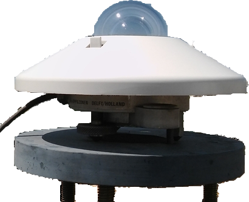
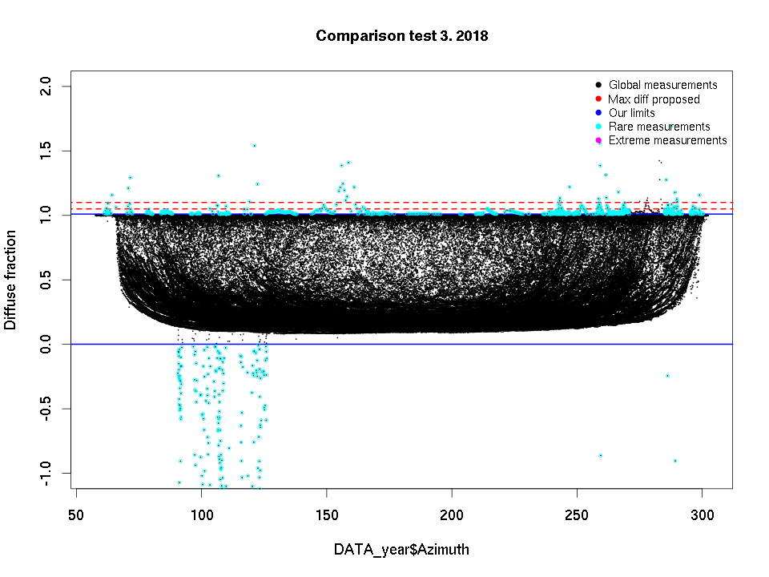
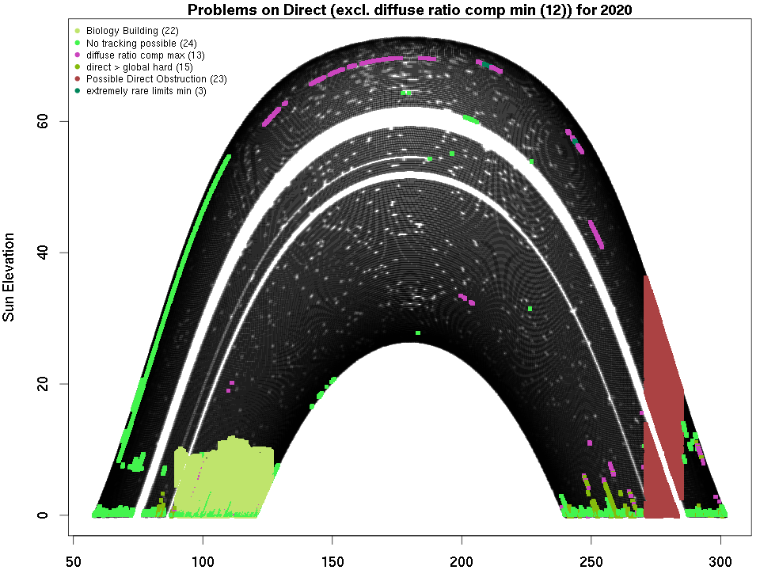

```{r setup, include=FALSE}
knitr::opts_chunk$set(echo = FALSE)
```


# Intro

## Question

\centering 
\Large
**Is there an asymmetry on the\
measured irradiance\
around South-North direction\
over Thessaloniki?**


# Broadband Instruments


## CHP-1

::: columns
:::: column

\vspace{3mm} 

- Beam irradiance (DNI)
- Tracking the sun
- 200nm - 4000nm

::::

:::: column

```{r chp1image, echo=FALSE,out.width="65%"}
knitr::include_graphics("files/P1110595e2.png")
```
::::

:::


## CM-21
::: columns
:::: column

\vspace{3mm} 

- Global irradiance (GLB)
- Viewing the "whole" sky
- 335nm - 2200nm

::::

:::: column

```{r, echo=FALSE,out.width="55%"}

```
::::

:::


# Data for this work

## Variables

- Data span: 2016 - 2019
- CHP-1: Beam irradiance (DNI) ($Watt/m^2$)
- CM-21: Diffuse irradiance (DHI) ($Watt/m^2$)\
 \ \ \ \ \ \ \ \ \ \ \   $\text{DHI} = \text{GHI} - \text{DNI} \cdot coz(z)$


## Main data process steps 

- Initial measurements
  - Manual inspection
    - Quality control checks and filtering\
    \scriptsize
    *An Automated Quality Assessment and Control Algorithm for Surface Radiation Measurements*, C. N. Long, Y. Shi, 2008
    
      \normalsize
      - "Clear sky" identification\
      \scriptsize
      *Identification of periods of clear sky irradiance in time series of GHI measurements*, Matthew J. Reno, Clifford W. Hansen, 2016


# Measurements

From voltage to watt...

```{r, echo=FALSE, out.height="80%",fig.cap=""}
knitr::include_graphics("files/Normal_L1_2019_733.pdf")
```


# Quality control, Physical limits

```{r  echo=FALSE,out.width="70%",fig.cap=""}

```


# Quality control, erroneous data

```{r  echo=FALSE,out.width="65%",fig.cap=""}

```


# Clear sky id


```{r, echo=FALSE, out.height="85%",fig.cap=""}
knitr::include_graphics("files/CS_detection_Reno-Hansen_HAU_2019_145.pdf")
```


# Analysis

## Key concepts 

- Bin data by:
  - Azimuth angle
  - Zenith/Elevation angle
  - Month
- Compute the average irradiance in each bin
    - The whole 4 year period
    - The same month of all years
- We present the **difference of averages** for **symmetric sky location** around North-South axis
  


# Results

Difference of averages no constrains

::: columns
:::: column

**Beam** 
\includegraphics[page=3,width=1.05\linewidth]{Thessaloniki_asymetry_CS_DIR.pdf}

::::

:::: column

**Diffuse**
\includegraphics[page=3,width=1.05\linewidth]{Thessaloniki_asymetry_CS_DIF.pdf}

::::

:::


# Results

Difference of averages with high statistical significance (**p<0.05**) and relative **difference of the sample size < 30%**


::: columns
:::: column

\includegraphics[page=9,width=1.05\linewidth]{Thessaloniki_asymetry_CS_DIR.pdf}

::::

:::: column

\includegraphics[page=9,width=1.05\linewidth]{Thessaloniki_asymetry_CS_DIF.pdf}

::::
:::


# Seasonal aspect

**January** Difference of averages no constrains


::: columns
:::: column

**Beam**
\includegraphics[page=10,width=1.05\linewidth]{Thessaloniki_asymetry_CS_DIR.pdf}

::::

:::: column

**Diffuse**
\includegraphics[page=10,width=1.05\linewidth]{Thessaloniki_asymetry_CS_DIF.pdf}

::::

:::


# Seasonal aspect

**February** Difference of averages no constrains

::: columns
:::: column

**Beam**
\includegraphics[page=11,width=1.05\linewidth]{Thessaloniki_asymetry_CS_DIR.pdf}

::::

:::: column

**Diffuse**
\includegraphics[page=11,width=1.05\linewidth]{Thessaloniki_asymetry_CS_DIF.pdf}

::::

:::


# Seasonal aspect

**March** Difference of averages no constrains

::: columns
:::: column

**Beam**
\includegraphics[page=12,width=1.05\linewidth]{Thessaloniki_asymetry_CS_DIR.pdf}

::::

:::: column

**Diffuse**
\includegraphics[page=12,width=1.05\linewidth]{Thessaloniki_asymetry_CS_DIF.pdf}

::::
:::


# Seasonal aspect

**April** Difference of averages no constrains


::: columns
:::: column

**Beam**
\includegraphics[page=13,width=1.05\linewidth]{Thessaloniki_asymetry_CS_DIR.pdf}

::::

:::: column

**Diffuse**
\includegraphics[page=13,width=1.05\linewidth]{Thessaloniki_asymetry_CS_DIF.pdf}

::::
:::


# Seasonal aspect

**May** Difference of averages no constrains


::: columns
:::: column

**Beam**
\includegraphics[page=14,width=1.05\linewidth]{Thessaloniki_asymetry_CS_DIR.pdf}

::::

:::: column

**Diffuse**
\includegraphics[page=14,width=1.05\linewidth]{Thessaloniki_asymetry_CS_DIF.pdf}

::::
:::


# Seasonal aspect

**June** Difference of averages no constrains

::: columns
:::: column

**Beam**
\includegraphics[page=15,width=1.05\linewidth]{Thessaloniki_asymetry_CS_DIR.pdf}

::::

:::: column

**Diffuse**
\includegraphics[page=15,width=1.05\linewidth]{Thessaloniki_asymetry_CS_DIF.pdf}

::::
:::


# Seasonal aspect

**July** Difference of averages no constrains


::: columns
:::: column

**Beam**
\includegraphics[page=16,width=1.05\linewidth]{Thessaloniki_asymetry_CS_DIR.pdf}

::::

:::: column

**Diffuse**
\includegraphics[page=16,width=1.05\linewidth]{Thessaloniki_asymetry_CS_DIF.pdf}

::::
:::


# Seasonal aspect

**August** Difference of averages no constrains


::: columns
:::: column

**Beam**
\includegraphics[page=17,width=1.05\linewidth]{Thessaloniki_asymetry_CS_DIR.pdf}

::::

:::: column

**Diffuse**
\includegraphics[page=17,width=1.05\linewidth]{Thessaloniki_asymetry_CS_DIF.pdf}

::::

:::


# Seasonal aspect

**September** Difference of averages no constrains


::: columns
:::: column

**Beam**
\includegraphics[page=18,width=1.05\linewidth]{Thessaloniki_asymetry_CS_DIR.pdf}

::::

:::: column

**Diffuse**
\includegraphics[page=18,width=1.05\linewidth]{Thessaloniki_asymetry_CS_DIF.pdf}

::::
:::


# Seasonal aspect


**October** Difference of averages no constrains


::: columns
:::: column

**Beam**
\includegraphics[page=19,width=1.05\linewidth]{Thessaloniki_asymetry_CS_DIR.pdf}

::::

:::: column

**Diffuse**
\includegraphics[page=19,width=1.05\linewidth]{Thessaloniki_asymetry_CS_DIF.pdf}

::::
:::


# Seasonal aspect

**November** Difference of averages no constrains


::: columns
:::: column

**Beam**
\includegraphics[page=20,width=1.05\linewidth]{Thessaloniki_asymetry_CS_DIR.pdf}

::::

:::: column

**Diffuse**
\includegraphics[page=20,width=1.05\linewidth]{Thessaloniki_asymetry_CS_DIF.pdf}

::::
:::


# Seasonal aspect

**December** Difference of averages no constrains

::: columns
:::: column

**Beam**
\includegraphics[page=21,width=1.05\linewidth]{Thessaloniki_asymetry_CS_DIR.pdf}

::::

:::: column

**Diffuse**
\includegraphics[page=21,width=1.05\linewidth]{Thessaloniki_asymetry_CS_DIF.pdf}

::::
:::


# Conclusions

## West part of the sky greater values of mean irradiance
  - Valid for Diffuse, Direct and Global component
  - For the 4-year period

## The balance can change during the year
  - Using only sza when analyzing this data may hide some information
  - Representation issues exist when generalizing 

## Diffuse and Direct irradiance bias shows a complementary distribution
  - It's a calculation artifact?
  - Which mechanisms attenuate these results?


---

\centering
\LARGE
**Thank you!**

\vspace{2em}

\scriptsize

[natsisthanasis@gmail.com](mailto:natsisthanasis@gmail.com)


---

```{r image-ref-for-in-text, echo = FALSE, message=FALSE, fig.align='center', fig.cap='Some cool caption', out.width='0.75\\linewidth', fig.pos='H'}
knitr::include_graphics("./files/CS_147.pdf")
```

<!-- \centering -->
<!-- ```{r, out.width = "300pt", fig.cap="Stations around the site."} -->
<!-- knitr::include_graphics("/home/athan/Ecotime_machine/Scripts/images/cartolight.png") -->
<!-- ``` -->

<!-- # Data Process -->

<!-- \centering -->
<!-- ```{r echo=F} -->
<!-- system('echo \' -->
<!-- digraph trackercon { -->

<!--     node [margin="0.001",  -->
<!--           shape=box,  -->
<!--           fontsize=10]; -->
<!--     graph [rankdir=LR,  -->
<!--            align=center,  -->
<!--            layout=dot,  -->
<!--            dpi=400]; -->
<!--     {rank=same  gfs wu davis } -->
<!--     {rank=same  " Evaluation " Validation  } -->

<!--     gfs [label=< GFS model <FONT POINT-SIZE="8"><BR ALIGN="CENTER"/> spatial/temporal <BR ALIGN="CENTER"/></FONT>>]; -->
<!--     wu  [label=< Weather Underground <FONT POINT-SIZE="8"><BR ALIGN="CENTER"/> multi point/temporal <BR ALIGN="CENTER"/></FONT>>]; -->
<!--     davis [label=< Weather station <FONT POINT-SIZE="8"><BR ALIGN="CENTER"/> on site <BR ALIGN="CENTER"/></FONT>>]; -->

<!--     gfs -> " Evaluation " ; -->
<!--     " Evaluation " -> "Spatial"; -->
<!--     wu -> " Evaluation "; -->
<!--     " Evaluation " -> "Temporal"; -->
<!--     davis      -> Validation -> "Temporal"  ; -->
<!--     Validation -> "Spatial"  ; -->
<!--     subgraph cluster { -->
<!--         label=<<FONT POINT-SIZE="9"> Climatology Data </FONT>>; -->
<!--         "Spatial"; -->
<!--         "Temporal"; -->
<!--     } -->

<!-- } -->

<!-- \' > images/trackercon.dot') -->
<!-- #system('dot -Tpdf graph.dot -o graph.pdf') -->
<!-- system('dot -Tpng images/trackercon.dot -o images/trackercon.png') -->
<!-- ``` -->
<!-- ```{r trackercon, echo=F,out.width="80%"} -->
<!-- knitr::include_graphics("images/trackercon.png") -->
<!-- ``` -->

<!-- # Products? -->


<!-- \begin{columns}[T] -->
<!-- \begin{column}[T]{.45\textwidth} -->
<!-- \vspace{0pt} -->

<!-- \begin{block}{Parameters} -->
<!--     \begin{itemize} -->
<!--         \item Temperature -->
<!--         \item Rainfall -->
<!--         \item Wind Direction -->
<!--         \item Wind Speed -->
<!--     \end{itemize}  -->
<!-- \end{block}  -->

<!-- \end{column} -->

<!-- \begin{column}[T]{.45\textwidth} -->

<!-- \begin{block}{Time scale coverage} -->
<!--     \begin{itemize} -->
<!--         \item Typical day / Typical day per season -->
<!--         \item Long term trends (monthly) -->
<!--         \item Hypothetical scenarios -->
<!--     \end{itemize}  -->
<!-- \end{block}  -->


<!-- \end{column} -->
<!-- \end{columns} -->

<!-- \centering -->
<!-- \begin{minipage}[t]{0.48\linewidth} -->
<!-- \begin{block}{Spatial coverage} -->
<!--     \begin{itemize} -->
<!--         \item Point  -->
<!--         \item Gridded -->
<!--         \item Multipoints -->
<!--     \end{itemize}  -->
<!-- \end{block}  -->
<!-- \end{minipage} -->
