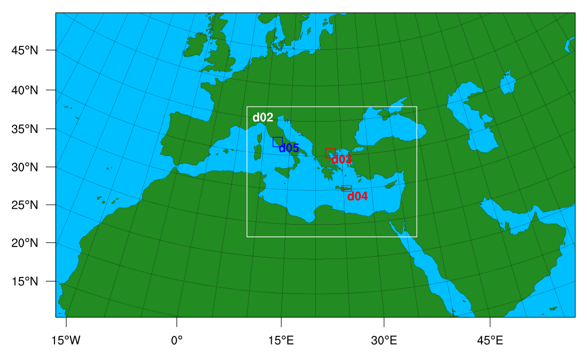
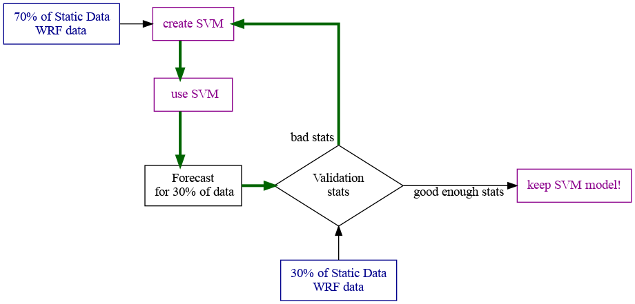

```{r setup, include=FALSE}
knitr::opts_chunk$set(echo = FALSE)
```


## Scope

- This work was applied on Thessaloniki and Rome
- WRF is a weather forecasting model
- Our WRF forecast depends on global weather data input from other sources 


# Intro

## What?

\centering 
\Large
\- Forecast the Urban Heat Island phenomenon\
\- Estimate impact to humans and infrastructure\
\- Forecasting on changes in local land use\
\- **At street level resolution!!** (250 m)


## How?

\centering 
\Large
\- Weather forecasting with WRF\
\- Use actual data for corrections\
\- Description of local conditions\
\- Add a computational level\


# Intro

## Not enough time

\centering 
\Large

A daily WRF forecast to $2000\,m\times2000\,m$ takes ~12 h (3 subdomains)\
for $250\,m\times250\,m$ **~20 h** (4 subdomains)


## Not enough data

\centering 
\Large
There are weather stations but...

- Not regularly maintained
- Time series suffer in quality
- Not ready available, Not direct access
- ...

Also, global models input data situation, not optimal...


# Use a non fancy AI thingy

\centering 
\Large
**Support vector machines (SVM) model**


```{r echo=F}
system('echo \'
digraph trackercon {

  # Intialization of graph attributes
  graph [align   = center,
         layout  = dot,
         rankdir = LR,
         dpi     = 300]

  node [shape    = box,
        fontsize = 10,
        margin   = 0.001 ]

  wrf0  [label = " WRF 2 x 2 km "];

  svm1  [label = " SVM Model " color=darkmagenta, fontcolor=darkmagenta];
  wrf1  [label = " Re-grid \n 250 x 250 m "];
  data1 [label = " Static data \n 250 x 250 m "];
  train [label = " training " shape = diamond];

    subgraph cluster_gc_1 {

        label = "Training";

        wrf0                     -> wrf1;

        wrf1                     -> train;
        data1                    -> train;
        train                    -> svm1;
        " Satellite data "       -> data1;
        " Weather \n observations " -> data1;

    }

}
\' > files/trackercon1.dot')
#system('dot -Tpdf graph.dot -o graph.pdf')
system('dot -Tpng files/trackercon1.dot -o files/trackercon1.png')
```


```{r echo=F}
system('echo \'
digraph trackercon {

  # Intialization of graph attributes
  graph [align   = center,
         layout  = dot,
         rankdir = LR,
         dpi     = 300]

  node [shape    = box,
        fontsize = 10,
        margin   = 0.001 ]

  svm2  [label = " SVM Model ",color=darkmagenta, fontcolor=darkmagenta];
  data2 [label = " Static data \n 250 x 250 m "];
  wrf2  [label = " WRF 2 x 2 km "];
 
   subgraph cluster_gc_2 {
        label = "Forecast";
        
        wrf2  -> svm2;
        data2 -> svm2;
        svm2  -> " Forecast \n 250 x 250 m ";
      }

}
\' > files/trackercon2.dot')
#system('dot -Tpdf graph.dot -o graph.pdf')
system('dot -Tpng files/trackercon2.dot -o files/trackercon2.png')
```
```{r trackercon, echo=F, out.width="49%"}


```


# SVM 

::: columns

:::: column

Supervised learning methods used for 

- classification 
- regression
- outliers detection

::::
:::: column

```{r chpge, echo=FALSE,out.width="100%"}

```

::::
:::

<!-- TYPE   <- "nu-regression" -->
<!-- ## Type -->
<!-- #     0 -- C-SVC        (multi-class classification) -->
<!-- #     1 -- nu-SVC       (multi-class classification) -->
<!-- #     2 -- one-class SVM -->
<!-- #     3 -- epsilon-SVR  (regression) -->
<!-- #     4 -- nu-SVR       (regression) -->

<!-- KERNEL <- "linear" -->
<!-- ## Kernel -->
<!-- #     0 -- linear: u'*v -->
<!-- #     1 -- polynomial: (gamma*u'*v + coef0)^degree -->
<!-- #     2 -- radial basis function: exp(-gamma*|u-v|^2) -->
<!-- #     3 -- sigmoid: tanh(gamma*u'*v + coef0) -->
<!-- #     4 -- precomputed kernel (kernel values in training_set_file) -->

# Static Data

\centering
```{r, echo=FALSE,out.width="32%"}


```


# WRF forecasting nested domains

\centering
```{r, echo=FALSE,out.width="80%"}

```


# Train, How?

\centering

```{r echo=F}
system('echo \'
digraph R {

  graph [splines=ortho]

  node [shape    = box,
        fontsize = 14,
        margin   = 0.1 ]
  
  data7  [ label = " 70% of Static Data \n WRF data ", color=blue4, fontcolor=blue4 ];
  data3  [ label = " 30% of Static Data \n WRF data ", color=blue4, fontcolor=blue4 ];

  nd_1   [label = " create SVM ", color=darkmagenta, fontcolor=darkmagenta];
  nd_2   [label = "   use SVM  ", color=darkmagenta, fontcolor=darkmagenta];
  nd_3   [label = " Forecast \n for 30% of data"];
  
  nd_4   [label = "Validation\nstats" shape = diamond];
  nd_5   [label = " keep SVM model! ", color=darkmagenta, fontcolor=darkmagenta];
 
  data7 -> nd_1;

 {rank=same data7 nd_1 }

//  data3 -> nd_2;
// {rank=same data3 nd_5  }

data3 -> nd_4  [weight = 100];


  nd_1 -> nd_2 -> nd_3 -> nd_4 [ color = darkgreen, penwidth=3 ];
 {rank=same nd_3 nd_4 nd_5 }
 

 nd_4 -> nd_1 [ taillabel="        bad stats " color = darkgreen penwidth=3  ];
 nd_4 -> nd_5 [ label="  good enough stats" ];


  //
  nd_1 -> nd_2 -> nd_3 -> data3 [ style = invis, weight= 10 ];
  //  data7 -> data3       [ style = invis, weight= 10 ];
  //    

}
\' > files/training.dot')
#system('dot -Tpdf graph.dot -o graph.pdf')
system('dot -Tpng files/training.dot -o files/training.png')
```

```{r echo=F, out.width="100%"}

```


# Train, on What?

\centering

Training is done over a **combination and selection** of variables, trying to **minimize RMSE**

::: columns

:::: column 

## Actual variables of WRF

- **Temperature**
- **Relative humidity**
- Wind direction
- Wind speed
- ... 7 more ...


::::
:::: column

## Local descriptors

- Coordinates
- **Land use** (Corine)
- **Emissivity "signal"** \footnotesize diff 2000m and 250m tile\normalsize
- **Albedo  "signal"**    \footnotesize diff 2000m and 250m tile\normalsize
- **Altitude "signal"**   \footnotesize diff 2000m and 250m tile\normalsize


::::
:::


::: columns

:::: column 


## Temporal descriptors

- Yearly periodic function
- Daily periodic function


::::

:::: column

##


- Tested the
"exponent" and "logarithm" of some variables
- **Bold variables** were always included

:::: 


:::


# SVM validation

\small


-------------------------------------------------------
City           Variable           RMSE     Bias     MAE
-------------- --------------- ------- -------- -------
Rome           Rel. Humidity     14.66    -5.74   11.24

Rome           Temperature        2.10    -0.57    1.57

Thessaloniki   Rel. Humidity     17.67   -10.64   13.73

Thessaloniki   Temperature        3.06     0.61    1.81
-------------------------------------------------------

Table: Validation of **WRF** and 2015 observational data.\label{tab:wrfstats}


------------------------------------------------------
City           Variable           RMSE    Bias     MAE
-------------- --------------- ------- ------- -------
Rome           Rel. Humidity     13.87   -4.65   11.30

Rome           Temperature        2.12   -0.37    1.64

Thessaloniki   Rel. Humidity     17.76   -9.81   14.11

Thessaloniki   Temperature        3.10    0.57    1.87
------------------------------------------------------

Table: Validation of **SVM model**, with 2015 observational data.\label{tab:svmstats}


# Although SVM is sensitive in albedo and emissivity.


::: columns

:::: column 
\centering


**Temperature**

```{r , echo=F, out.width="100%"}

```


::::
:::: column
\centering

**Relative humidity**

```{r , echo=F, out.width="100%"}

```

::::
:::
\centering

Worked for Rome only...


# What we learned


::: columns

:::: column 

## The good stuff

- Possible to apply correction/modifications on WRF forecasts
- Use actual observations in current forecasts to improve predictions
- Create a tool for emissivity and albedo effects prediction
- SVM model easy to use after creation

::::
:::: column

## The bad stuff

- We need more data
- Better data
- More variability!!!
- Training is expensive, have to be parallelized 


::::
:::


# Optimistically 

\centering

\- Experience on predictions/modeling with SVM

\- New parameterizations will be tested

\- More and better data \footnotesize(observational and modeled)\normalsize \ are coming in the future

\- More extensive search on SVM algorithm search space can be performed


---

\centering
\LARGE
**Thank you!**

\vspace{2em}

\scriptsize

[natsisthanasis@gmail.com](mailto:natsisthanasis@gmail.com)


<!-- # Data Process -->

<!-- \centering -->
<!-- ```{r echo=F} -->
<!-- system('echo \' -->
<!-- digraph trackercon { -->

<!--     node [margin="0.001",  -->
<!--           shape=box,  -->
<!--           fontsize=10]; -->
<!--     graph [rankdir=LR,  -->
<!--            align=center,  -->
<!--            layout=dot,  -->
<!--            dpi=400]; -->
<!--     {rank=same  gfs wu davis } -->
<!--     {rank=same  " Evaluation " Validation  } -->

<!--     gfs [label=< GFS model <FONT POINT-SIZE="8"><BR ALIGN="CENTER"/> spatial/temporal <BR ALIGN="CENTER"/></FONT>>]; -->
<!--     wu  [label=< Weather Underground <FONT POINT-SIZE="8"><BR ALIGN="CENTER"/> multi point/temporal <BR ALIGN="CENTER"/></FONT>>]; -->
<!--     davis [label=< Weather station <FONT POINT-SIZE="8"><BR ALIGN="CENTER"/> on site <BR ALIGN="CENTER"/></FONT>>]; -->

<!--     gfs -> " Evaluation " ; -->
<!--     " Evaluation " -> "Spatial"; -->
<!--     wu -> " Evaluation "; -->
<!--     " Evaluation " -> "Temporal"; -->
<!--     davis      -> Validation -> "Temporal"  ; -->
<!--     Validation -> "Spatial"  ; -->
<!--     subgraph cluster { -->
<!--         label=<<FONT POINT-SIZE="9"> Climatology Data </FONT>>; -->
<!--         "Spatial"; -->
<!--         "Temporal"; -->
<!--     } -->

<!-- } -->

<!-- \' > images/trackercon.dot') -->
<!-- #system('dot -Tpdf graph.dot -o graph.pdf') -->
<!-- system('dot -Tpng images/trackercon.dot -o images/trackercon.png') -->
<!-- ``` -->
<!-- ```{r trackercon, echo=F,out.width="80%"} -->
<!-- knitr::include_graphics("images/trackercon.png") -->
<!-- ``` -->

<!-- \begin{columns}[T] -->
<!-- \begin{column}[T]{.45\textwidth} -->
<!-- \vspace{0pt} -->

<!-- \begin{block}{Parameters} -->
<!--     \begin{itemize} -->
<!--         \item Temperature -->
<!--         \item Rainfall -->
<!--         \item Wind Direction -->
<!--         \item Wind Speed -->
<!--     \end{itemize}  -->
<!-- \end{block}  -->

<!-- \end{column} -->

<!-- \begin{column}[T]{.45\textwidth} -->

<!-- \begin{block}{Time scale coverage} -->
<!--     \begin{itemize} -->
<!--         \item Typical day / Typical day per season -->
<!--         \item Long term trends (monthly) -->
<!--         \item Hypothetical scenarios -->
<!--     \end{itemize}  -->
<!-- \end{block}  -->


<!-- \end{column} -->
<!-- \end{columns} -->
