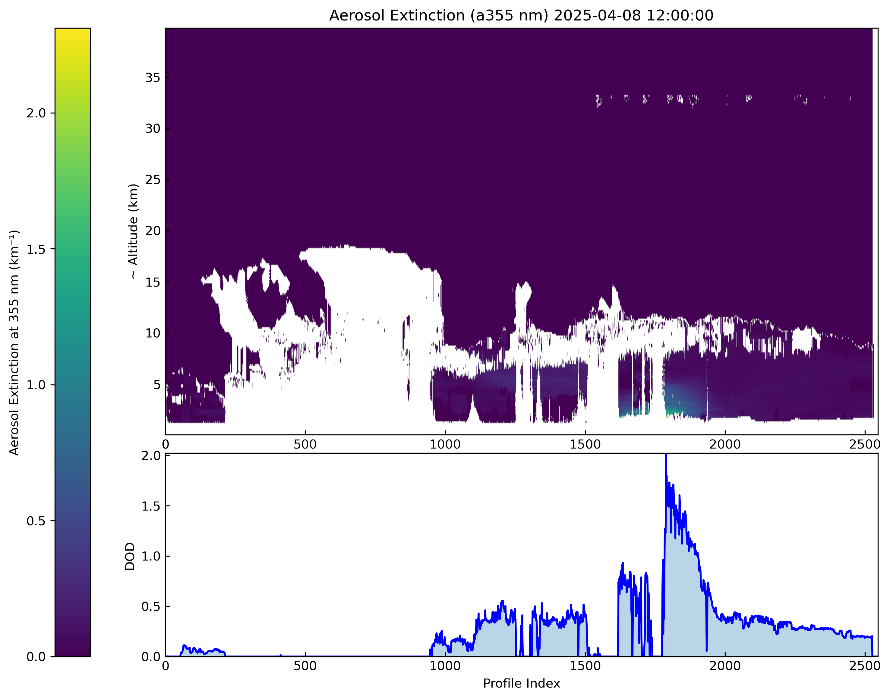
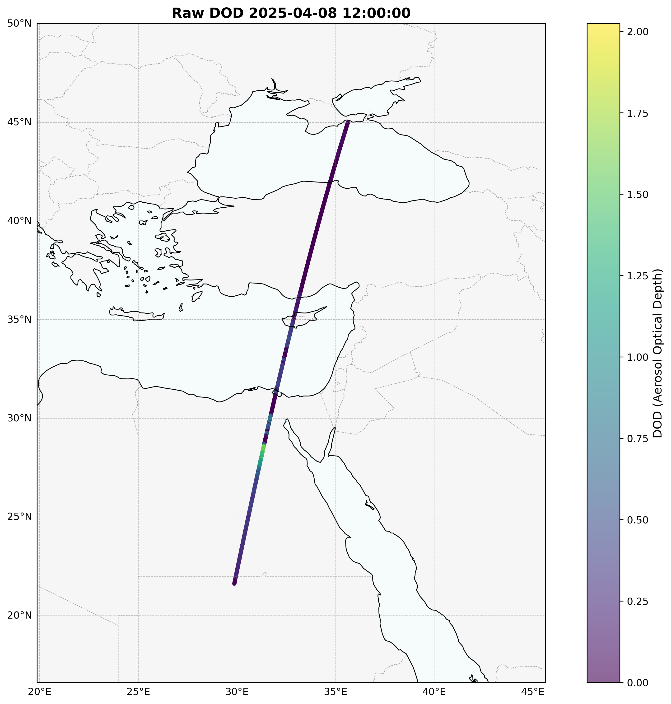
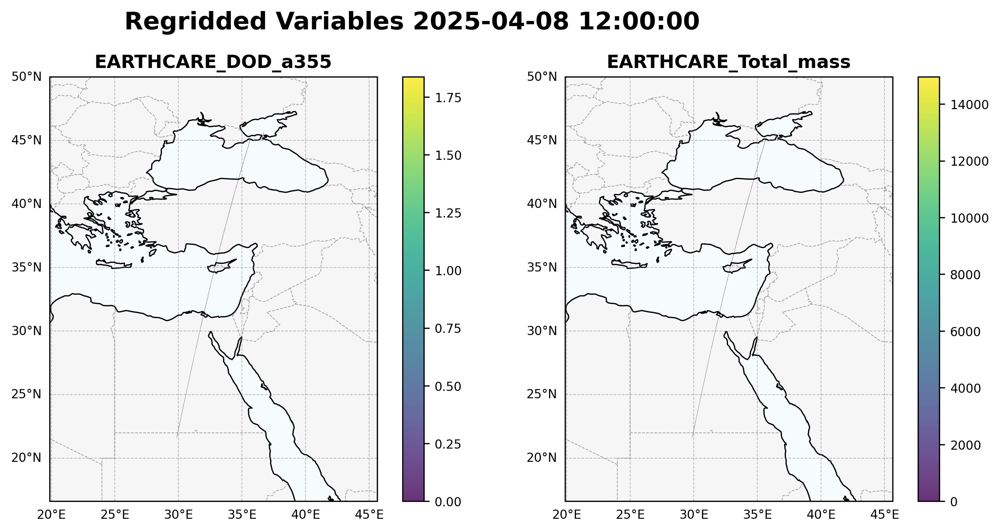
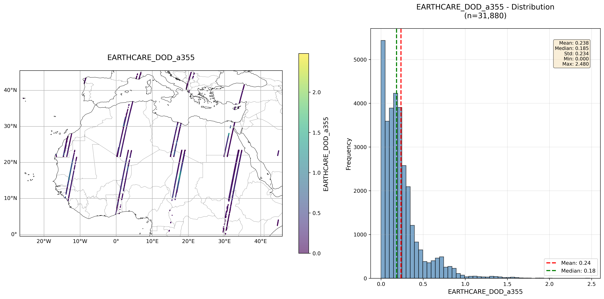
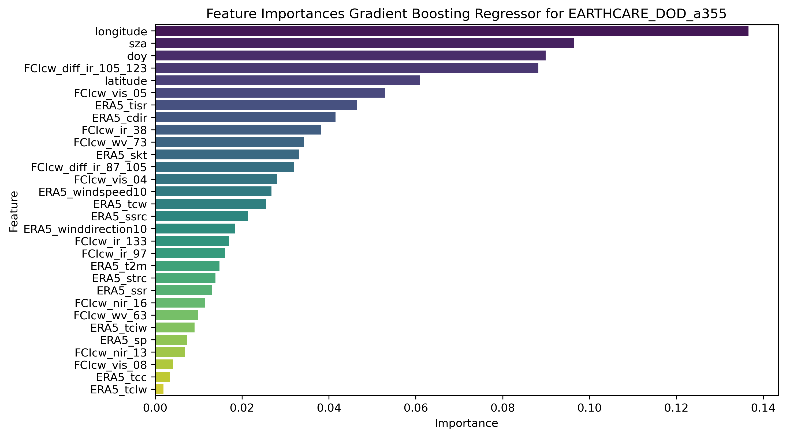
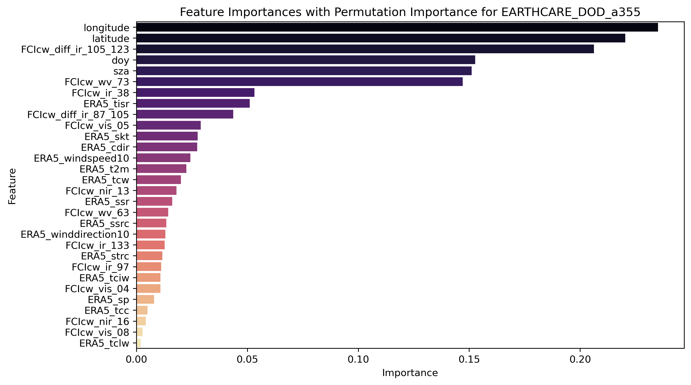
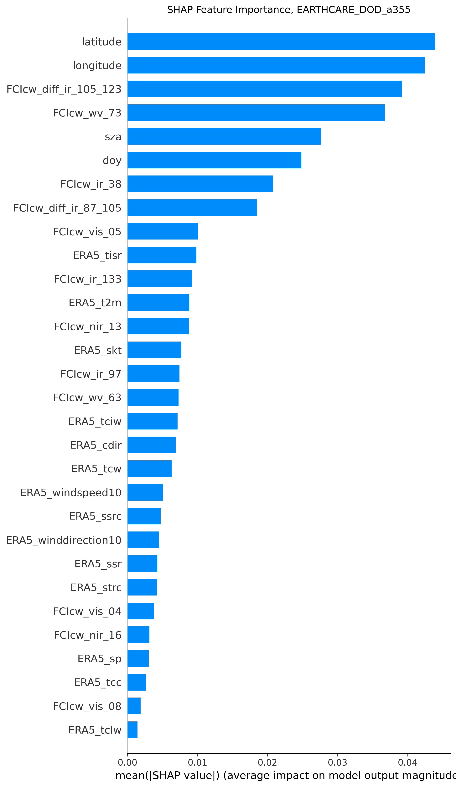

<!--

## Outline

- Introduction
- Data and Methods
- Machine Learning Approach
- Results
- Conclusions and Future Work

---

-->

### Goal

\centering
\Large
**Retrieve dust properties from GEO satellite imagery**
\normalsize

### Background

- Use Meteosat Third Generation (MTG) high-temporal resolution satellite data
- Retrieve DOD (Dust Optical Depth)
- Analytical methods already exist, but they have limitations

###  Main research Questions

- Can ML models improve DOD retrieval accuracy?
- Can ML models achieve a generalized retrieval scheme?
- Which input variables are the most important?

---

## General implementation/workflow

1. Get/create relevant data
2. Train and optimize machine learning models
3. Select the best-performing approach
4. Analyze scope of ML application
5. Independent validation
6. Final retrieval product/method

---

## Data

### Target Data Sources

- **EarthCARE (current)**
  - Point measurements
  - Continuous LEO swaths
  - OREO product...
    1. **DOD @ 355 nm** from vertical profiles
    2. **Total mass** from vertical profiles

- **SLSTR Level 2 Aerosol Optical Depth - Sentinel-3**
  - 9.5 × 9.5 km^2^
  - Continuous LEO swaths
  - Initial development (currently discontinued)
  - May be used for independent validation

---

## Data

### Features Data Sources

- **FCI** Level 1c Normal Resolution Image Data - MTG - 0 degree
  - 16 spectral channels every **10 minutes** at **1 - 2 km**
- **Cloud Mask** - MTG - 0 degree (from FCI)
  -  every **10 minutes** at **2 km**
- **ERA5** hourly data on single levels
  - every 1 h at 0.25° × 0.25°
  - 27 selected variables on the surface
- LSA/SAF MTG Land Surface Temperature (**MTLST**) from FCI
  - every 10 minutes at 2 km
  - not used currently

### Other Data

- **SZA** calculated for each grid point/time
- **Land mask** created from OSM polygons data

---

## Data use

### Naive approach

  - Date range: **2025-03-19 -- 2025-05-10**
  - Temporal resolution: **30 minutes**
  - Random sample 70/15/15

### More realistic setup (planned)

  - Date range: **whole year**
  - Temporal resolution: **hourly**
  - Chronological split 70/15/15 or specific seasons.

### Domain

\small
|           |          |          |
|-----------|---------:|----------|
|           | **45 N** |          |
| **-30 W** |          | **45 E** |
|           | **0 S**  |          |
\normalsize

---

## Data preprocessing

- Regrid onto a regular grid: **0.02° × 0.02°**
  - Near the resolution of the finer available data
  - Data representation on the grid coordinates (center of cell)

Regrid methods:

  - EarthCARE $\rightarrow$ mean values within the cells
  - Rest of data $\rightarrow$ **nearest** neighbor values to grid
    - Preserve original values (no spatial smoothing/interpolation)
  - ERA5 $\rightarrow$ temporal interpolation within hourly data

---

## Raw Data view

{fig-align="center" width="90%"}

---

## Calculated DOD

{fig-align="center" width="60%"}

---

## Regridded

{fig-align="center" width="95%"}

---

## Domain

{fig-align="center" width="100%"}

---

## Machine Learning

### Current "naive" approach $\longrightarrow$ favorably selected data

- **Over Land only**
- **No cloudy sky**
- **Sun lit domain**

\footnotesize
| Dataset |      N | Split  |
|--------:|-------:|--------|
|  Train  | 194442 | 70.1%  |
|  Valid  |  41340 | 14.9%  |
|   Test  |  41550 | 14.9%  |
\normalsize

### Potential problems

- Random split too good results, too easy too fast ...?
- Trainig of ML models:
  - over the oceans?
  - with mixed clouds?
  - longer time ranges of other periods of year?

---

## Model training/tuning iterative process

- Multiple feature importance tests were implemented
- Initial evaluation of **9 ML** models
- The most promising models:
  - **Decision Tree**
  - **Random Forest**
  - **XGBoost**
- Iterative Hyperparameters optimization (2 approaches)
  - Minimize **MSE** with manual features selection (multiple validation metrics are evaluated)
  - Minimize **MSE** with automatic methods of features selection (multiple validation metrics are evaluated)
  - Multiple validation metrics are evaluated on each batch's best

---

## 'Naive' results

### Multiple ML models achieve very high performance!?

\footnotesize
|  Target    | Model          | Trials | Best_r2 | Best_rmse | Best_mae |
|-----------:|---------------:|-------:|--------:|----------:|---------:|
| DOD_a355   | Decision Tree  |    673 |  0.9659 |    0.0381 |   0.0171 |
|            | Random Forest  |    684 |  0.9714 |    0.0349 |   0.0169 |
|            | XGBoost        |    626 |  0.9749 |    0.0327 |   0.0171 |
| Total_mass | Decision Tree  |    750 |  0.9538 |  346.6828 | 137.7835 |
|            | Random Forest  |    750 |  0.9714 |  272.8909 | 123.6965 |
|            | XGBoost        |    720 |  0.9762 |  248.7359 | 123.7431 |
\normalsize

### Additional metrics can also be considered

**R^2^**,
**RMSE**,
**MAE**,
**MSE**,
**N_samples**,
**pred_min**,
**pred_max**,
**pred_mean**,
**pred_std**

---

## Things missing

- Cross-validation with independent data
- Use weather forecasts (train for NRT conditions)?
- Extend the EarthCARE Dataset
- Multi-season evaluation and training
- Regional Validation
  - Mediterranean
  - Middle East
  - Atlantic
  - North Africa
- Analysis of the effects of:
  - Data selection (no cloudy, over land)
  - Features (physical meaning, relation to analytical methods
  - Hyperparameters of the models

More meaningful evaluation
- Bias (mean error)
- Error vs DOD bins (performance at high dust!)
- Spatial maps of error
- Case studies (dust events)?

<!--

---

## Conclusions

---

### Key Findings

-->

---

### Future Work

- Most of the infrastructure in place
- ML can fit DOD well under controlled conditions
- Results likely optimistic due to split strategy
- Next step: realistic validation

---

## Thank You!

**Q&A.....**

\footnotesize
- **Email**:        [anatsis@noa.gr](mailto:anatsis@noa.gr)
- **Project**:      [github.com/NOA-ReACT/DUSTR](https://github.com/NOA-ReACT/DUSTR)
- **Presentation:** [github.com/thanasisn/presentations](https://github.com/thanasisn/presentations)
\normalsize

---

## Example of features importance selection

{fig-align="center" width="95%"}

## Example of features importance selection

{fig-align="center" width="95%"}

## Example of features importance selection

{fig-align="center" height="90%"}

## Example of features importance selection

{fig-align="center" height="90%"}

## Example of features importance selection

\begin{center}
\includegraphics[width=0.95\textwidth]{figures/gpu-2_Percusion_OREO_base_B046_Features_Importance_013.png}
\end{center}

## Example of features importance selection

\begin{center}
\includegraphics[width=0.95\textwidth]{figures/gpu-2_Percusion_OREO_base_B046_Features_Importance_014.png}
\end{center}

## Example of features importance selection

\begin{center}
\includegraphics[width=0.95\textwidth]{figures/gpu-2_Percusion_OREO_base_B046_Features_Importance_015.png}
\end{center}

## Example of features importance selection

\begin{center}
\includegraphics[width=0.95\textwidth]{figures/gpu-2_Percusion_OREO_base_B046_Features_Importance_016.png}
\end{center}

## Example of features importance selection

\begin{center}
\includegraphics[width=0.95\textwidth]{figures/gpu-2_Percusion_OREO_base_B046_Features_Importance_017.png}
\end{center}

## List of almost all variables

\footnotesize
EARTHCARE_DOD_a355
EARTHCARE_Total_mass
EARTHCARE_timestamp
ERA5_cdir
ERA5_cvh
ERA5_cvl
ERA5_expver
ERA5_lai_hv
ERA5_lai_lv
ERA5_lsm
ERA5_number
ERA5_skt
ERA5_sp
ERA5_ssr
ERA5_ssrc
ERA5_sst
ERA5_str
ERA5_strc
ERA5_t2m
ERA5_tcc
ERA5_tciw
ERA5_tclw
ERA5_tcw
ERA5_tcwv
ERA5_tisr
ERA5_tp
ERA5_tvh
ERA5_tvl
ERA5_u10
ERA5_u10n
ERA5_v10
ERA5_v10n
ERA5_valid_time
ERA5_winddirection10
ERA5_windspeed10
FCI_diff_ir_105_123
FCI_diff_ir_87_105
FCI_ir_105
FCI_ir_123
FCI_ir_133
FCI_ir_38
FCI_ir_87
FCI_ir_97
FCI_nir_13
FCI_nir_16
FCI_nir_22
FCI_vis_04
FCI_vis_05
FCI_vis_06
FCI_vis_08
FCI_vis_09
FCI_wv_63
FCI_wv_73
FCIcw_diff_ir_105_123
FCIcw_diff_ir_87_105
FCIcw_ir_105
FCIcw_ir_123
FCIcw_ir_133
FCIcw_ir_38
FCIcw_ir_87
FCIcw_ir_97
FCIcw_nir_13
FCIcw_nir_16
FCIcw_nir_22
FCIcw_vis_04
FCIcw_vis_05
FCIcw_vis_06
FCIcw_vis_08
FCIcw_vis_09
FCIcw_wv_63
FCIcw_wv_73
MTCM_quality_illumination
MTCM_quality_mtg_parameters
MTCM_quality_nwp_parameters
MTCM_quality_overall_processing
MTLST_LST
MTLST_LST_uncertainty
MTLST_QFLAGS
doy
latitude
longitude
sza
time
\normalsize

---

## Data representation check

{fig-align="center" width="95%"}

---

## Data representation check

{fig-align="center" width="95%"}

---

## Data representation check

{fig-align="center" width="95%"}

---

## Data representation check

{fig-align="center" width="95%"}

---

## Data representation check

{fig-align="center" width="95%"}

---

## TODO

Temporal split (train: March–April, test: May)

Spatial split (train: part of domain, test: different region)

Event-based split (dust events separation)

Removing the hardest cases (cloud contamination)
Removing ocean (different radiative properties)
Removing night (important for GEO applications)

The model is learning a clean subset, not the real problem.

